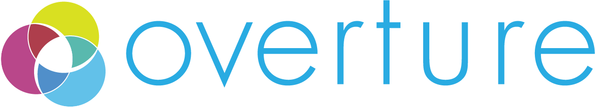

 

 

 

## Worry Less Science More

We (the [OICR Genome Informatics Team](https://softeng.oicr.on.ca/team/)) develop the [Ego](https://www.overture.bio/products/ego/) authentication and authorization microservice in this Overture repository. 

[Overture]((https://www.overture.bio/)) is a collection of open-source, extendable solutions, designed for big-data genomic science. Our core products offer a comprehensive set of tools for securely contributing, accessing, analyzing, visualizing and sharing molecular and clinical data. Visit our [website](https://www.overture.bio/) for more information on what Overture has to offer, and check out our other projects on [GitHub](https://github.com/overture-stack/).

## Ego - Authentication & Authorization

Access to sensitive and valuable information necessitates complex and secure user authentication and authorization methods. [Ego](https://www.overture.bio/products/ego/)  simplifies user management by providing a secure system to authenticate and authorize users of your application. 

[Ego](https://www.overture.bio/products/ego/) uses well-known single-sign-on identity providers like Google, GitHub, LinkedIn and ORCiD in place of managing usernames and passwords. 

Ego is [OAuth 2.0](https://oauth.net/2/) and [OpenID Connect](https://auth0.com/docs/authenticate/protocols/openid-connect-protocol) compliant. It is written in JAVA and uses [Sprint Boot](https://spring.io/projects/spring-boot) and [Spring Security Frameworks](https://spring.io/projects/spring-security). Because it uses [JSON Web Tokens (JWT)](https://jwt.io/) for stateless authorization, it can scale to accommodate many users. See our thorough [documentation](https://www.overture.bio/documentation/ego/) for further details. 

## Related Products 

While each component can be deployed independently within any given software architecture our core solutions can also work in concert to provide an end-to-end data management lifecycle. This data management system (DMS) is designed to meet the needs of modern large-scale genomic research. Please see our [DMS documentation](https://www.overture.bio/documentation/dms/) for more information on our data management system (DMS).

## Table of Contents

- [Installation](#installation)
- [Usage](#usage)
- [Contribution](#how-to-contribute)
- [Feedback](#feedback)
- [Code of Conduct](#code-of-conduct)
- [License](#license)

## Installation

For more information please see the documentation linked below:

- [Setup Prerequisites](https://www.overture.bio/documentation/ego/installation/prereq/)
- [Installation](https://www.overture.bio/documentation/ego/installation/installation/)
- [Configuration](https://www.overture.bio/documentation/ego/installation/configuration/)
- [Authentication](https://www.overture.bio/documentation/ego/installation/authentication/)

## Usage

For more information please see the documentation linked below:

- [Using the Admin UI](https://www.overture.bio/documentation/ego/user-guide/admin-ui/)
- [Using the API](https://www.overture.bio/documentation/ego/user-guide/api/)

## Contribute

* [Making a Contribition ](CONTRIBUTING.md)
* [Filing an issue](https://github.com/overture-stack/ego/issues)

## Feedback

* Connect with us on [Slack](http://slack.overture.bio)
* [Upvote](https://github.com/overture-stack/ego/issues?q=is%3Aopen+is%3Aissue+label%3Anew-feature+sort%3Areactions-%2B1-desc) feature requests

## Code of Conduct

&emsp; 

## License

Licensed under the [GNU Lesser General Public License v3.0](LICENSE.txt) license.
